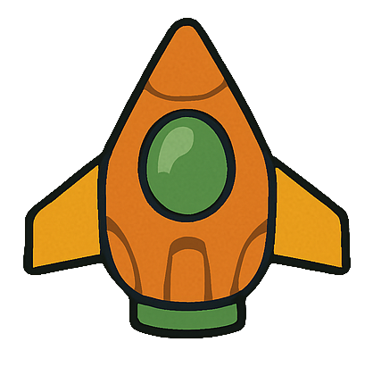
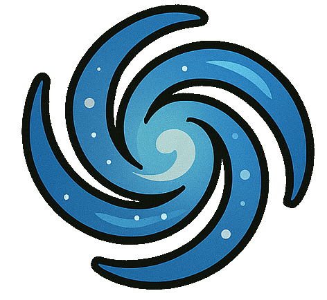
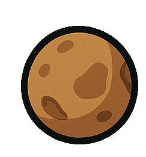
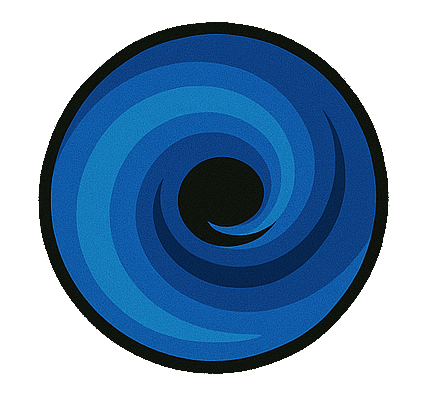

# Sprite Sheet Previews

These are all the sprites currently in this repo:

### Astroid.png

### Bullet.png

### Cannon.png

### Enemey Ship.png

### Enemey Ship1.png

### Enemey Ship2.png

### Enemey Ship3.png

### Enemey Ship4.png

### Falme1.png

### Flame2.png

### Flame3.png

### Galaxy1.png

### Long Projectile.png

### Missle1.png

### Missle2.png

### Missle3.png

### Missle4.png

### Missle5.png

### Moon1.png

### Moon2.png

### Nebula1.png

### Orb1.png

### Orb2.png

### Orb3.png

### Particle1.png

### Particle2.png

### Partivcle3.png

### Planet1.png

### Planet2.png

### Planet3.png

### Planet4.png

### Player Space Craft.png

### Player Space Craft2.png

### SatelitteDisk.png

### Smoke1.png

### Smoke2.png

### Smoke3.png

### Smoke4.png

### Smoke5.png

### SpaceJunk1.png

### SpaceJunk2.png

### SpaceJunk3.png

### SpaceJunk4.png

### SpaceStation1.png

### Star1.png

### Sun1.png

### Wormhole1.png

###### AI-Assisted Assets
###### Some of the images and scripts in this project were created with assistance from ChatGPT by OpenAI, based on my design prompts and direction.
###### All assets are either original works, AI-generated based on original input, or derivative works created through post-processing.
###### These contributions are released under the MIT License alongside the rest of the project.